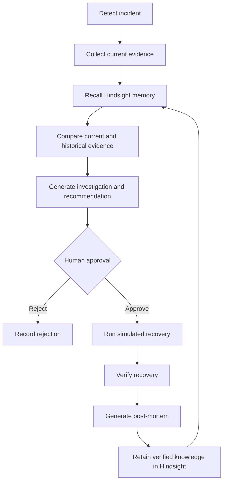

# IncidentMind

## AI Incident Response Agent with Persistent Operational Memory

IncidentMind is an AI-assisted engineering incident response system. It combines current incident evidence with persistent operational memory from previous incidents to help engineers investigate recurring failures and make evidence-based response decisions.

IncidentMind is a controlled prototype, not a fully autonomous production incident manager. Historical memory supports investigation, but it does not automatically determine the current root cause.

## Problem

Engineering teams repeatedly encounter API failures, latency spikes, database connection exhaustion, deployment-related failures, and service outages. Without persistent operational memory, engineers may investigate similar failures from the beginning each time.

IncidentMind connects the current incident with relevant historical operational experience. Engineers can compare what is happening now with what happened before, review an explainable recommendation, approve or reject the proposed response, and retain verified knowledge for future incidents.

## Solution

The application implements this incident learning workflow:

```text
Incident Detected
        |
Triage and Current Evidence
        |
Recall Historical Experience
        |
Compare Current and Historical Evidence
        |
AI Investigation and Recommendation
        |
Human Approval
        |
Simulated Recovery
        |
Post-Mortem
        |
Retain Verified Knowledge
        |
Future Incident Recall
```

The persisted incident state machine is:

```text
DETECTED -> TRIAGING -> INVESTIGATING -> AWAITING_APPROVAL
    -> APPROVED -> RECOVERING -> RECOVERED -> POST_MORTEM
    -> MEMORY_RETAINED
```

A human rejection follows `AWAITING_APPROVAL -> REJECTED`. Invalid transitions are rejected by the API. When Hindsight is unavailable, an investigation records the failed memory operation while keeping the incident retryable.

## Persistent Operational Memory with Hindsight

Hindsight is the persistent operational memory layer. The integration uses the configured Hindsight client for health checks, bank provisioning, recall, reflection, and retention.

### RETAIN

After recovery and post-mortem generation, IncidentMind can retain verified operational knowledge including:

- incident context and ID
- affected service
- symptoms and current evidence
- possible root cause
- action taken
- recovery result
- lessons learned
- prevention recommendation

The application reports `MEMORY UPDATED` only after the real Hindsight retain request succeeds. Failed operations are recorded as failed memory operations and return `MEMORY UPDATE FAILED` with the underlying reason.

### RECALL

During investigation, IncidentMind sends the current incident context to Hindsight and retrieves relevant operational experience. Recalled memories can provide:

- similar incidents
- previous symptoms
- previous root causes
- previous resolutions
- lessons learned
- investigation guidance

Hindsight memories are evidence and hypotheses, not guaranteed diagnoses. Current evidence must be checked before an action is approved.

### Hindsight Configuration

Copy `.env.example` to `.env` and configure the Hindsight deployment:

```dotenv
HINDSIGHT_API_URL=http://localhost:8888
HINDSIGHT_API_KEY=your-api-key
HINDSIGHT_BANK_ID=incidentmind
HINDSIGHT_TIMEOUT_SECONDS=15
```

`HINDSIGHT_API_URL` is required. `HINDSIGHT_API_KEY` is passed to the client and is required by Hindsight deployments that authenticate requests. `HINDSIGHT_BANK_ID` defaults to `incidentmind`. `HINDSIGHT_TIMEOUT_SECONDS` defaults to 15 seconds and limits each client request.

IncidentMind reports `HINDSIGHT: CONNECTED` only after a real Hindsight request succeeds. It provisions or updates the configured bank through the Hindsight client before memory operations. Never commit a real API key.

## What Makes IncidentMind Different

IncidentMind is not simply a chatbot interface. Its operational learning loop connects:

```text
CURRENT INCIDENT
+ CURRENT EVIDENCE
+ HISTORICAL MEMORY
+ INVESTIGATION
+ HUMAN APPROVAL
+ VERIFIED OUTCOME
+ PERSISTENT LEARNING
```

The system separates current facts from historical evidence, explains why a recalled experience may be relevant, and keeps the response human-controlled.

## Features

### Incident Command Center

The Flask-rendered dashboard shows active, resolved, and failed incident counts; historical matches; the selected incident; severity; service; deployment; current evidence; workflow state; timeline; and operational panels.

The primary demo incident is deterministic and idempotent: `INC-019` is created once if missing. Refreshing the page or restarting Flask does not create another copy.

### Incident Investigation

Investigation uses the incident title, description, service, severity, deployment, backend-owned simulated telemetry, current evidence, and Hindsight recall. The response stores the investigation, historical evidence, comparison, recommendation, and timeline events in SQLite.

### Hindsight Memory

The Memory Vault retrieves real Hindsight memories. It displays an unavailable state and the real error when Hindsight cannot be reached; it does not fabricate historical incidents or counts.

### Evidence Comparison

Current evidence is kept separate from recalled historical evidence. The backend calculates matching signals, conflicting evidence, and a historical relevance label from the available text. It does not invent a numeric similarity score.

### Explainable Investigation

The current Hindsight reflection schema returns:

- possible root cause
- recommended action
- historical lesson
- explanation of relevance
- supporting evidence facts when returned

The current implementation does not expose a separate numeric confidence field; recommendations remain hypotheses for engineer review.

### Human Approval Gate

Recommendations are presented for engineer review. The response is not automatically executed. An operator can approve or reject an action, and the API prevents approval after an invalid or terminal state.

### Simulated Recovery

An approved action can trigger a clearly labelled simulated recovery. The demo stores before/after values such as error rate, latency, and database connections in SQLite. These values are demonstration metrics, not production telemetry.

### Post-Mortem

After simulated recovery, IncidentMind generates and stores a structured post-mortem containing impact, timeline, root cause hypothesis, evidence, action taken, recovery result, lessons learned, and prevention recommendation.

### Persistent Learning

A post-mortem can be retained through the real Hindsight retain operation. The final incident state becomes `MEMORY_RETAINED` only after that operation succeeds.

### Incident History

Incident records are stored in SQLite and can be selected from the dashboard. Records include the backend-generated incident key, service, severity, state, deployment, description, evidence, timeline, investigation, recovery, post-mortem, and memory status.

### Analytics

Analytics are computed from SQLite incident records and memory-operation records. They include total, active, resolved, and failed incidents; historical matches; successful retains; failed memory operations; and the most affected service.

## Demonstration Scenario

### Primary Incident: INC-019

- **Service:** `payment-api`
- **Deployment:** `v2.4.1`
- **Severity:** `CRITICAL`
- **Symptoms:**
  - HTTP 500 errors
  - increased API latency
  - high database connection usage
  - database timeout errors
  - recent deployment

The backend stores the exact demo description as current evidence:

> HTTP 500 errors are increasing after deployment v2.4.1. API latency has increased to approximately 1840 ms. Database connections are at 98/100 and database timeout errors are occurring.

Backend-owned demo telemetry is explicitly labelled `DEMO / SIMULATED TELEMETRY`:

- Error rate: 38%
- Latency: 1840 ms
- Database connections: 98 / 100
- Deployment: `v2.4.1`
- Database timeouts: Detected
- Service: Degraded

### Historical Pattern: INC-001

The historical operational memory describes a related Payment API failure involving:

- HTTP 500 errors
- recent deployment
- database connection exhaustion
- timeout errors
- high latency

The historical resolution was to roll back the deployment and restore the connection pool. IncidentMind must compare the current evidence with this historical evidence before making a recommendation; it must not assume that `INC-019` has the same root cause.

### Similar Future Incident

`POST /api/incidents/simulate-similar` creates `INC-020` only after an explicit user action. Repeating the action returns the existing incident instead of creating a duplicate. The new incident can then be investigated and used to demonstrate future recall.

## Human-in-the-Loop Response

IncidentMind presents the current evidence, historical evidence, investigation explanation, recommendation, and supporting facts for engineer review. The engineer chooses:

- `APPROVE ACTION`
- `REJECT`

Approval enables simulated recovery. Rejection records `Action rejected by human operator` and prevents recovery. No unrestricted production action is executed by this prototype.

## Learning Loop



## Architecture

```text
Browser UI
    |
Flask Application
    |
Incident APIs and workflow state machine
    |--------------------|
SQLite incident store  Hindsight service
                           |
                    Recall / Reflect / Retain
```

The browser uses Flask-rendered HTML, CSS, and JavaScript. Flask serves incident creation, retrieval, investigation, workflow transitions, observability demo data, analytics, memory operations, and post-mortem endpoints. SQLite stores incident fields, state transitions, evidence, timeline, recovery, post-mortem, and memory-operation status. Hindsight supplies persistent operational memory when configured and reachable.

Human approval sits between recommendation and simulated recovery. Retention happens after recovery and post-mortem generation.

See [docs/architecture.md](docs/architecture.md) for the component and learning-loop diagram.

## Technology Stack

- **Frontend:** HTML, CSS, JavaScript
- **Backend:** Python and Flask
- **Structured incident storage:** SQLite
- **Persistent operational memory:** Hindsight client
- **Configuration:** `.env` and Python virtual environment

## Setup

Requirements:

- Python 3.10 or newer
- A reachable Hindsight deployment for recall, reflection, and retention

PowerShell setup:

```powershell
python -m venv .venv
.\.venv\Scripts\Activate.ps1
python -m pip install -r requirements.txt
Copy-Item .env.example .env
```

Edit `.env` with the Hindsight URL and authentication required by your deployment. Never commit real API keys.

## Run

```powershell
python app.py
```

Open:

```text
http://127.0.0.1:5000
```

## Demo Walkthrough

1. Start IncidentMind.
2. Open the Command Center.
3. Select or create an incident.
4. Review current evidence and simulated telemetry.
5. Investigate the incident.
6. Recall historical operational memory.
7. Compare current and historical evidence.
8. Review the AI investigation.
9. Review the recommended action.
10. Approve or reject the recommendation.
11. If approved, run the simulated recovery.
12. Review recovery results.
13. Generate the post-mortem.
14. Retain verified knowledge.
15. Create a similar future incident.
16. Recall the retained operational knowledge.

When Hindsight is not configured, the dashboard shows `HINDSIGHT: OFFLINE`; investigation and memory requests return a clear unavailable response. Local incident data remains stored in SQLite where the requested operation supports it. The application never claims Hindsight is connected without a successful real request.

## API

The implemented routes are:

| Method | Route | Purpose |
| --- | --- | --- |
| `GET` | `/health` | Application health check |
| `GET` | `/api/hindsight/status` | Real Hindsight connectivity status and configuration error |
| `GET` | `/api/demo/observability` | Backend-owned simulated demo telemetry |
| `POST` | `/api/incidents` | Create an incident with a backend-generated key |
| `GET` | `/api/incidents` | List incidents |
| `GET` | `/api/incidents/<reference>` | Retrieve an incident by numeric ID or incident key |
| `POST` | `/api/investigate` | Investigate a persisted incident or support the legacy payload-only call |
| `POST` | `/api/incidents/<key>/recall` | Recall and investigate a persisted incident |
| `POST` | `/api/incidents/<key>/approve` | Record human approval |
| `POST` | `/api/incidents/<key>/reject` | Record human rejection |
| `POST` | `/api/incidents/<key>/recover` | Run simulated recovery after approval |
| `POST` | `/api/incidents/<key>/postmortem` | Generate and persist a post-mortem after recovery |
| `POST` | `/api/incidents/<key>/retain` | Retain the post-mortem through real Hindsight |
| `POST` | `/api/incidents/simulate-similar` | Explicitly create or return `INC-020` |
| `GET` | `/api/memories` | Retrieve real Hindsight memories for the Memory Vault |
| `POST` | `/api/outcome` | Legacy outcome endpoint; successful outcomes should use the stateful workflow |
| `GET` | `/api/stats` | Computed incident and recall statistics |
| `GET` | `/api/analytics` | Computed incident and memory-operation analytics |

## Testing

Start Flask in one terminal for the HTTP smoke tests:

```powershell
python app.py
```

Run the existing tests from another terminal:

```powershell
python test_flask.py
python test_investigation.py
python test_hindsight.py
python test_workflow.py
```

`test_workflow.py` uses isolated temporary SQLite databases and mocks Hindsight to cover idempotent seeding, simulated telemetry, offline configuration, investigation, comparison, approval, rejection, recovery, post-mortem, retention, similar-incident creation, and invalid transitions.

`test_flask.py` and the legacy `test_investigation.py` call the running Flask server. `test_hindsight.py` calls Hindsight directly. The Hindsight-dependent tests require a configured and reachable Hindsight service; without `.env`, they fail with the expected configuration/unavailable response.

## Project Status

IncidentMind is a prototype demonstrating AI-assisted incident investigation with persistent operational memory. It is designed for controlled demonstration and development environments.

Simulated recovery metrics are demonstration data and do not represent real production telemetry. AI investigation results and recalled historical knowledge are hypotheses that should be verified by an engineer before operational use.

## Limitations

- Hindsight requires a reachable configured service for recall, reflection, and retention.
- External production observability integrations are not assumed; the included telemetry is simulated demo data.
- Recovery actions in the demonstration environment are simulated.
- AI investigation results require human verification.
- The prototype does not automatically execute unrestricted production changes.
- Production deployment would require authentication, authorization, audit logging, observability integrations, security controls, and operational safeguards.

## Future Scope

Potential future integrations include:

- Prometheus, Grafana, or Cloud monitoring platforms
- CI/CD deployment systems
- Incident alerting platforms
- Service dependency maps
- Automated runbook discovery
- Richer post-mortem generation
- Role-based access control
- Audit trails
- Production-safe action integrations
