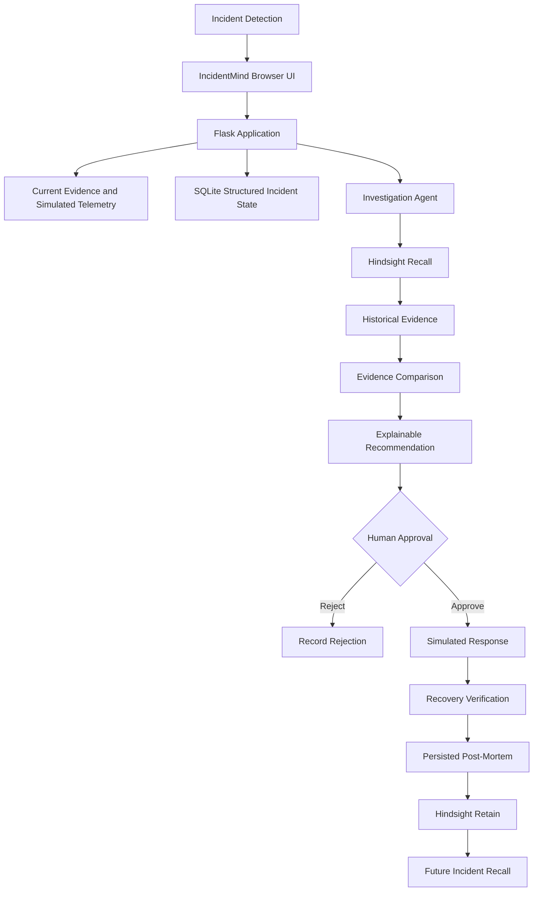

# IncidentMind Architecture

IncidentMind is a Flask and SQLite application that combines current incident state with persistent operational memory from Hindsight.



## Browser UI

The Flask-rendered HTML page in `templates/index.html` uses the JavaScript client in `static/js/app.js` and the command-center stylesheet in `static/css/style.css`. The browser loads the selected incident, current evidence, backend-owned demo telemetry, Hindsight status, workflow controls, timeline, recovery result, post-mortem, history, memory vault, and analytics.

The UI does not fabricate historical memory. When Hindsight is unavailable it displays the offline/unavailable state returned by the backend.

## Flask Application

`app.py` owns:

- incident creation and retrieval
- idempotent INC-019 initialization
- backend-generated incident keys
- simulated observability data
- lifecycle state transitions
- current-versus-historical evidence comparison
- approval and rejection gates
- simulated recovery
- post-mortem generation
- memory-operation status
- Hindsight status, recall, and retention routes

The persisted lifecycle is:

```text
DETECTED -> TRIAGED -> INVESTIGATING -> AWAITING_APPROVAL
    -> APPROVED -> RECOVERING -> RECOVERED -> POST_MORTEM
    -> MEMORY_RETAINED
```

`AWAITING_APPROVAL -> REJECTED` is the human rejection path. The API rejects invalid transitions such as recovery without approval, duplicate approval, post-mortem before recovery, and retention before post-mortem.

## SQLite Structured State

`incidentmind.db` preserves the existing `incidents` table and adds workflow fields through startup migration. Structured state includes:

- incident key, service, severity, deployment, and detection time
- symptoms and current evidence
- historical evidence and investigation output
- recommendation and approval status
- action taken and recovery result
- timeline, post-mortem, lessons, and memory status
- backend-owned demo telemetry

The `memory_operations` table records recall, demo-seed, and retain successes or failures. `app_metadata` records one-time compatibility cleanup so debug reloads do not delete later user-created incidents.

## Investigation and Comparison

Investigation sends the current incident context, current evidence, service, deployment, severity, and telemetry to Hindsight. Returned memories are kept separate from current evidence. The backend compares textual signals such as HTTP 500 errors, deployment timing, connection saturation, timeout errors, and latency.

The historical root cause is treated as a hypothesis. The UI explicitly states that historical memory supports the hypothesis but current evidence must be verified before action.

## Hindsight Memory

`services/hindsight_service.py` reads:

- `HINDSIGHT_API_URL`
- `HINDSIGHT_API_KEY`
- `HINDSIGHT_BANK_ID`

It uses the installed Hindsight client for bank provisioning, `aget_version()` health checks, `arecall()`, `areflect()`, and `aretain()`. The configured bank is created or updated through the real Hindsight API before memory operations. No API key or historical memory is hardcoded as a successful external result.

The historical INC-001 experience is retained through Hindsight when configured. If Hindsight is unavailable, the operation is recorded as failed and the incident remains retryable.

## Human Approval and Simulated Recovery

The recommendation endpoint does not execute an external action. The operator must approve or reject it. Approval enables the recovery endpoint; rejection records a timeline event and prevents recovery.

Recovery writes clearly labelled demo metrics to SQLite. It does not call a production deployment, database, or service control system.

## Post-Mortem and Learning Loop

After recovery, the post-mortem endpoint persists impact, root-cause hypothesis, evidence, resolution, recovery result, what worked, what did not work, lessons, and recommended follow-up. Retention then serializes this verified operational knowledge and sends it to Hindsight. `MEMORY UPDATED` is returned only after real retention succeeds.

## External Boundary

Prometheus, Grafana, cloud monitoring, CI/CD, alerting platforms, authentication, authorization, audit identity, and production action systems are not part of the current application. The observability values are deterministic demo data and are labelled accordingly.
